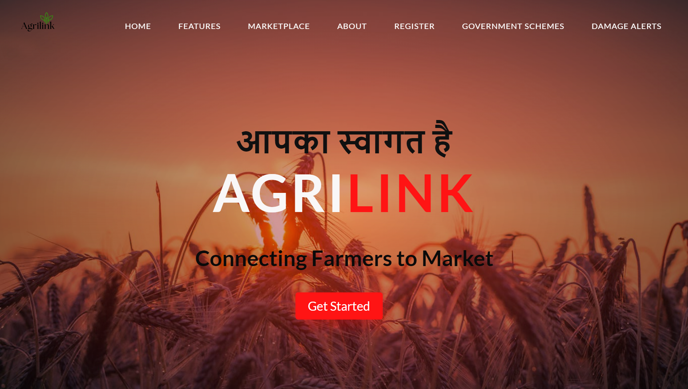
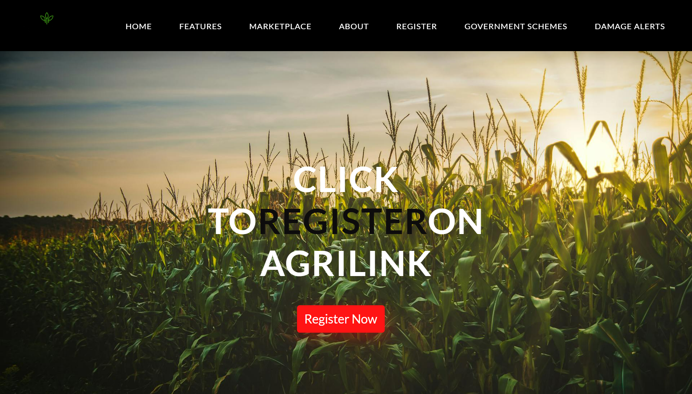
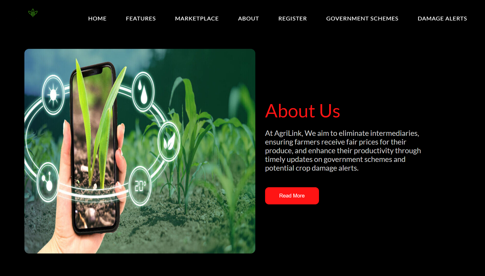
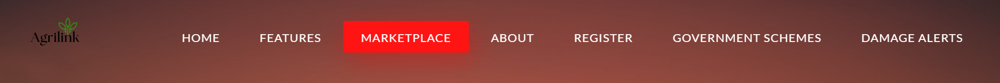
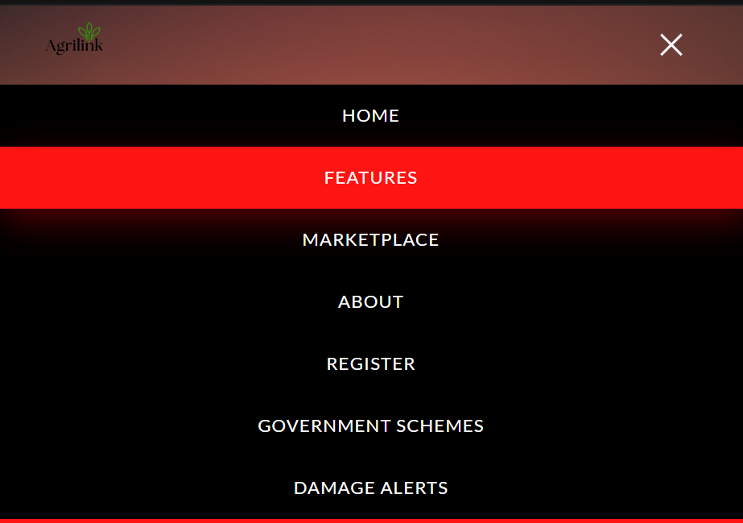

# Agrilink PROTOTYPE - Hackathon by Hack2Skill

## Description
This Repo Contains the PROTOTYPE of Agrilink Website Which is a Part of Round 2 of Hackathon Organized by Hack2Skill. 
**Agrilink** is a comprehensive web application designed to empower smallholder farmers by bridging the gap between them and potential buyers, including consumers and businesses. Developed for the Hack2Skill Hackathon, Agrilink aims to solve the pressing issues of market access, awareness of government schemes, and timely alerts about potential agricultural damage.

## Screenshots






## Presentation
The project presentation is available [here](./docs/Round2ppt.pptx).

## Demo Video
Watch our demo video to see Agrilink in action: Demo Video [Link](https://www.canva.com/design/DAGMnnBG-KE/p6DA6Pqij1J3CSEvIh1zzA/watch?utm_content=DAGMnnBG-KE&utm_campaign=designshare&utm_medium=link&utm_source=editor).

## Setup Instructions 
1. Clone the repository:
   ```bash
   git clone https://github.com/your-username/agrilink-hackathon.git

2. Navigate to the project directory:
   ```bash
   cd agrilink-hackathon

3. Install the dependencies:
   ```bash
   npm install

4. Start the development server:
   ```bash
   npm start

## Contributors
* Gaurav Vashistha
* Ankit Singh Chouhan
* Aditya Singh
* Aniket Patel

### 6. Push to GitHub

1. Initialize a local Git repository:
   ```bash
   git init

2. Add the remote repository:
   ```bash
   git remote add origin https://github.com/your-username/agrilink-hackathon.git

3. Add all files and commit:
   ```bash
   git add .
   git commit -m "Initial commit with project structure, source code, PPT, and README"

4. Push to GitHub:
   ```bash
   git push -u origin master

## Note:
***This is a Minimal Viable Product (MVP) prototype developed for the Hack2Skill Hackathon. It showcases the core features and functionality of Agrilink with minimal implementation. If we advance to Round 3, we plan to complete and enhance Agrilink, adding more advanced features, improving the user interface, and ensuring a robust and fully functional platform that truly empowers smallholder farmers.***

**Thank you for considering Agrilink. We look forward to potentially bringing this project to its full potential in the next phase of the hackathon.**


  

